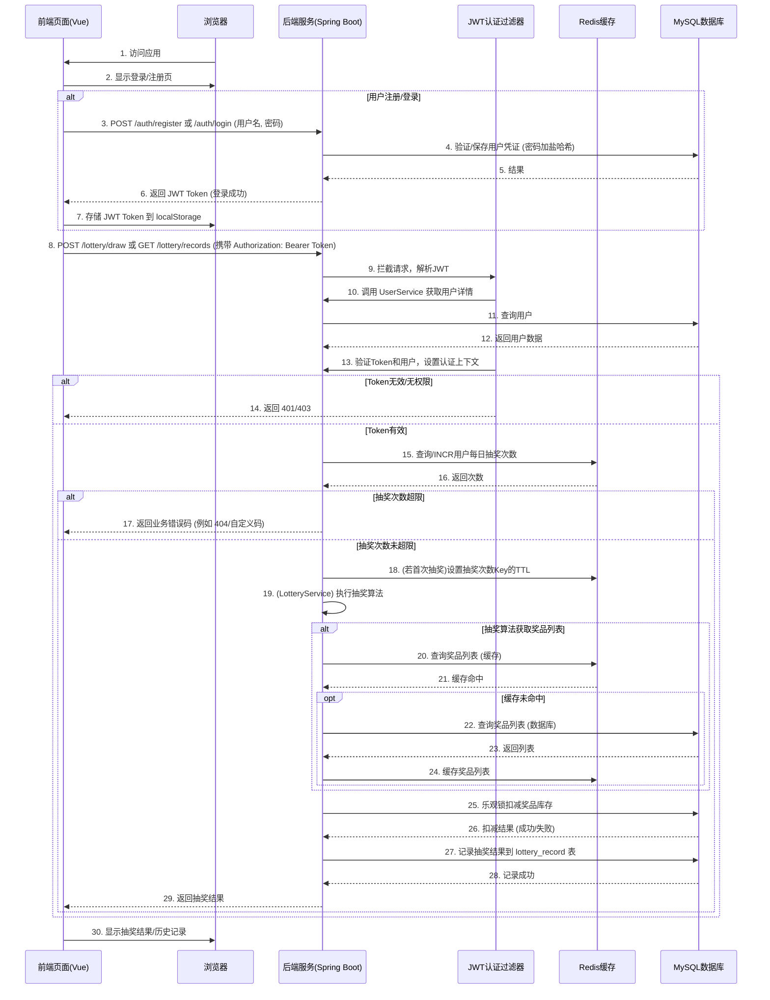

# **抽奖系统后端开发说明书 - V3.0**

## **1. 引言 (Introduction)**

### **1.1 项目背景与目标**

本项目旨在构建一个基于 Spring Boot 的后端抽奖系统，并配套一个独立的前端 Vue 3 页面。系统核心功能包括奖品管理、抽奖逻辑处理（基于概率和库存）、并发安全扣减库存。

在 V3.0 版本中，我们在 V2.0 引入 Redis 缓存的基础上，**全面实现了用户系统、抽奖次数限制、JWT 认证以及抽奖历史记录功能**，使系统更符合真实业务场景的需求。

主要目标包括：

*   实现一个稳定可靠的后端抽奖逻辑，能够处理奖品管理、库存扣减和基于概率的抽奖算法。
*   确保在高并发场景下，奖品库存不会出现超卖问题。
*   通过引入 Redis 缓存，显著提升奖品列表读取性能，降低数据库压力。
*   **实现用户注册、登录、认证和授权机制，保护核心 API。**
*   **限制单个用户在特定时间段内的抽奖次数，防止恶意刷奖。**
*   **记录并查询用户的每一次抽奖历史，无论中奖与否。**
*   提供易于理解和操作的用户界面，方便用户参与抽奖。
*   作为学习和实践现代 Java 后端开发（Spring Boot, MyBatis-Plus, MySQL, Redis, Spring Security, JWT）以及前后端分离模式的入门项目。

### **1.2 功能范围**

**核心功能：**

*   **奖品管理**: 能够定义不同类型的奖品，包括奖品名称、总数量、当前剩余数量以及中奖概率。
*   **抽奖逻辑**: 根据预设的奖品概率和剩余库存，决定用户是否中奖及中何种奖品。
*   **库存扣减**: 用户中奖后，对应奖品的剩余库存自动减少。
*   **并发安全**: 通过乐观锁机制处理高并发抽奖场景，防止超卖。
*   **概率抽奖**: 实现基于预设概率的抽奖算法。
*   **奖品数据缓存**: 将奖品列表缓存至 Redis，减少数据库读取压力，提高性能。
*   **用户注册与登录**: 提供用户注册和基于用户名/密码的登录功能。
*   **JWT 认证**: 用户登录成功后颁发 JWT Token，后续请求携带 Token 进行身份验证。
*   **API 授权**: 保护抽奖等核心 API，只允许认证用户访问。
*   **抽奖次数限制**: 基于 Redis 实现用户每日抽奖次数限制。
*   **抽奖历史记录**: 记录用户的每一次抽奖（中奖、未中奖、并发冲突等）到数据库。
*   **抽奖历史查询**: 提供接口查询当前用户的抽奖历史记录，支持分页。

**用户界面 (前端 - 独立 Vue 3 项目):**

*   用户登录/注册页面。
*   抽奖页面，显示剩余抽奖次数，点击抽奖并显示结果。
*   抽奖历史记录页面，显示用户所有抽奖记录，支持分页。
*   页面间路由导航和认证保护。

### **1.3 核心技术栈**

本项目采用当下流行的前后端分离架构，后端基于 Spring Boot，前端为纯静态页面。

| 类别       | 技术名称             | 版本        | 备注                                     |
| :--------- | :------------------- | :---------- | :--------------------------------------- |
| **后端**   | Spring Boot          | `3.2.5`     | Java Web 应用快速开发框架                |
|            | Spring Framework     | `6.1.6`     | Spring Boot 3.2.5 内部依赖的核心框架     |
|            | MyBatis-Plus         | `3.5.5`     | 简化 MyBatis 操作，兼容 Spring Boot 3.x |
|            | MySQL                | `8.x`       | 关系型数据库                             |
|            | MySQL Connector/J    | 最新兼容版  | 连接 MySQL                               |
|            | Lombok               | 最新兼容版  | 简化 Java Bean 代码                      |
|            | Redis                | `6.x / 7.x` | 分布式缓存数据库                         |
|            | Spring Data Redis    | `3.2.5`     | Spring 对 Redis 的集成                   |
|            | **Spring Security**  | `6.2.4`     | **认证与授权框架**                       |
|            | **jjwt**             | `0.11.5`    | **JWT (JSON Web Token) 处理库**          |
| **前端**   | Vue 3                | `3.x`       | 渐进式 JavaScript 框架                   |
|            | Vite                 | `7.x`       | 前端构建工具                             |
|            | Vue Router           | `4.x`       | Vue 官方路由管理器                       |
|            | HTML, CSS, JavaScript | -           | 页面结构、样式、交互                     |
| **构建/管理** | Maven                | `3.x`       | 项目依赖管理和构建                       |
| **开发环境** | Java Development Kit | `17`        | Java 运行时环境                          |
|            | IntelliJ IDEA        | 最新稳定版  | 开发工具                                 |
| **测试工具** | curl / Postman       | -           | 命令行 API 测试工具                      |

## **2. 系统架构设计 (System Architecture Design)**

### **2.1 逻辑架构**

系统采用经典的三层架构，职责清晰，便于维护和扩展。在 V3.0 中，增加了用户认证/授权、抽奖记录和 Redis 抽奖次数限制的模块。

*   **表现层 (Controller Layer)**: 负责接收用户请求，包括认证、抽奖、记录查询，调用业务逻辑层，并将处理结果返回给前端。
*   **业务逻辑层 (Service Layer)**: 封装核心业务逻辑，包括用户注册/登录、抽奖算法、库存管理、事务控制、**抽奖次数校验**、**抽奖记录保存**等，并集成缓存逻辑。
*   **数据持久层 (Mapper/DAO Layer)**: 负责与数据库交互，执行 CRUD (增删改查) 操作，包括用户、奖品和抽奖记录。
*   **缓存层 (Cache Layer)**: 使用 Redis 缓存热点数据（奖品列表）和**用户每日抽奖次数**，减少数据库压力。
*   **安全层 (Security Layer)**: Spring Security 过滤器链负责请求的拦截、JWT 解析、用户认证和授权。

### **2.2 模块交互图**



## **3. 开发环境搭建 (Development Environment Setup)**

### **3.1 必备软件安装**

1.  **JDK 17**:
    *   下载地址: [Oracle JDK](https://www.oracle.com/java/technologies/downloads/) 或 [OpenJDK](https://openjdk.org/install/)
    *   安装并配置 `JAVA_HOME` 环境变量。
2.  **Maven 3.x**:
    *   下载地址: [Apache Maven](https://maven.apache.org/download.cgi)
    *   解压到指定目录，并配置 `M2_HOME` 和添加到 `Path` 环境变量。
3.  **Node.js (含 npm)**:
    *   下载地址: [Node.js 官方网站](https://nodejs.org/zh-cn/download/) (LTS 版本)
    *   安装并验证 `node -v` 和 `npm -v`。
4.  **MySQL 8.x**:
    *   下载地址: [MySQL Community Server](https://dev.mysql.com/downloads/mysql/)
    *   安装并启动 MySQL 服务。
    *   **创建数据库**: 登录 MySQL，执行 `CREATE DATABASE lottery;`
5.  **Redis 6.x / 7.x**:
    *   下载地址: [Redis 官方网站](https://redis.io/download/)
    *   安装并启动 Redis 服务（默认端口 6379）。
    *   **验证**: 在命令行输入 `redis-cli ping`，如果返回 `PONG` 则表示 Redis 运行正常。
6.  **IntelliJ IDEA**:
    *   下载地址: [JetBrains IntelliJ IDEA](https://www.jetbrains.com/idea/download/)
    *   安装并启动。

### **3.2 项目初始化 (Spring Initializr)**

1.  访问 [https://start.spring.io/](https://start.spring.io/)。
2.  配置项目信息如下：
    *   **Project**: Maven Project
    *   **Language**: Java
    *   **Spring Boot**: `3.2.5`
    *   **Group**: `com.miku`
    *   **Artifact**: `Lottery`
    *   **Name**: `Lottery`
    *   **Package name**: `com.miku.lottery`
    *   **Packaging**: Jar
    *   **Java**: `17`
    *   **Dependencies**:
        *   `Spring Web`
        *   `MySQL Driver`
        *   `Lombok`
        *   `MyBatis-Plus` (此为占位，后续 `pom.xml` 中将替换为 `mybatis-plus-spring-boot3-starter`)
        *   `Spring Data Redis`
        *   `Spring Security` (重要！)
        *   `Spring Boot DevTools` (可选)
        *   `Spring Boot Actuator` (可选)
3.  点击 `GENERATE` 下载项目压缩包。
4.  解压项目到本地目录（例如 `A:\study\javaee\lottery\Lottery`）。
5.  在 IntelliJ IDEA 中，选择 `File` -> `Open`，然后选择解压后的项目根目录。

## **4. 数据库设计与初始化 (Database Design & Initialization)**

除了 V1.0 中的 `prize` 表，V3.0 新增了 `user` 表和 `lottery_record` 表。

### **4.1 `prize` 表结构**

```sql
-- prize: 奖品表
CREATE TABLE `prize` (
  `id` BIGINT AUTO_INCREMENT COMMENT '主键ID',
  `prize_name` VARCHAR(255) NOT NULL COMMENT '奖品名称',
  `total_quantity` INT NOT NULL DEFAULT 0 COMMENT '总库存',
  `remaining_quantity` INT NOT NULL DEFAULT 0 COMMENT '剩余库存',
  `probability` DECIMAL(5, 4) NOT NULL DEFAULT 0.0000 COMMENT '中奖概率（0到1之间）',
  `version` INT NOT NULL DEFAULT 0 COMMENT '乐观锁版本号',
  `create_time` DATETIME DEFAULT CURRENT_TIMESTAMP COMMENT '创建时间',
  `update_time` DATETIME DEFAULT CURRENT_TIMESTAMP ON UPDATE CURRENT_TIMESTAMP COMMENT '更新时间',
  PRIMARY KEY (`id`)
) COMMENT='奖品信息表';
```

### **4.2 `user` 表结构**

```sql
-- user: 用户表
CREATE TABLE `user` (
  `id` BIGINT AUTO_INCREMENT COMMENT '主键ID',
  `username` VARCHAR(50) NOT NULL UNIQUE COMMENT '用户名',
  `password_hash` VARCHAR(255) NOT NULL COMMENT '密码哈希值',
  `salt` VARCHAR(32) NOT NULL COMMENT '盐值，用于密码哈希',
  `create_time` DATETIME DEFAULT CURRENT_TIMESTAMP COMMENT '创建时间',
  `update_time` DATETIME DEFAULT CURRENT_TIMESTAMP ON UPDATE CURRENT_TIMESTAMP COMMENT '更新时间',
  PRIMARY KEY (`id`)
) COMMENT='用户信息表';
```

### **4.3 `lottery_record` 表结构**

```sql
-- lottery_record: 抽奖记录表
CREATE TABLE `lottery_record` (
  `id` BIGINT AUTO_INCREMENT COMMENT '主键ID',
  `user_id` BIGINT NOT NULL COMMENT '用户ID，关联user表',
  `prize_id` BIGINT COMMENT '奖品ID，关联prize表（如果中奖）',
  `prize_name` VARCHAR(255) NOT NULL COMMENT '奖品名称（冗余存储，方便查询）',
  `is_winning` TINYINT(1) NOT NULL COMMENT '是否中奖 (0: 未中奖, 1: 中奖)',
  `draw_time` DATETIME DEFAULT CURRENT_TIMESTAMP COMMENT '抽奖时间',
  PRIMARY KEY (`id`),
  KEY `idx_user_id` (`user_id`), -- 为用户ID创建索引，方便按用户查询记录
  KEY `idx_draw_time` (`draw_time`) -- 为抽奖时间创建索引，方便按时间查询
) COMMENT='用户抽奖记录表';
```

### **4.4 初始数据插入**

在 MySQL 客户端或数据库管理工具中执行以下 SQL 语句，为 `prize` 表插入初始数据：

```sql
INSERT INTO `prize` (`prize_name`, `total_quantity`, `remaining_quantity`, `probability`, `version`) VALUES
('一等奖：iPhone 15 Pro', 1, 1, 0.0010, 0),
('二等奖：华为 MatePad', 5, 5, 0.0100, 0),
('三等奖：10元优惠券', 100, 100, 0.2000, 0),
('四等奖：1元红包', 1000, 1000, 0.5000, 0),
('谢谢参与', 999999, 999999, 0.2890, 0);
```

## **5. 后端代码实现 (Backend Code Implementation)**

### **5.1 `pom.xml` 文件**

```xml
<?xml version="1.0" encoding="UTF-8"?>
<project xmlns="http://maven.apache.org/POM/4.0.0" xmlns:xsi="http://www.w3.org/2001/XMLSchema-instance"
		 xsi:schemaLocation="http://maven.apache.org/POM/4.0.0 https://maven.apache.org/xsd/maven-4.0.0.xsd">
	<modelVersion>4.0.0</modelVersion>
	<parent>
		<groupId>org.springframework.boot</groupId>
		<artifactId>spring-boot-starter-parent</artifactId>
		<version>3.2.5</version> <!-- Spring Boot 版本 -->
		<relativePath/> <!-- lookup parent from repository -->
	</parent>

	<groupId>com.miku</groupId>
	<artifactId>Lottery</artifactId>
	<version>0.0.1-SNAPSHOT</version>
	<name>Lottery</name>
	<description>Lottery</description>
	<url/>
	<licenses>
		<license/>
	</licenses>
	<developers>
		<developer/>
	</developers>
	<scm>
		<connection/>
		<developerConnection/>
		<tag/>
		<url/>
	</scm>
	<properties>
		<java.version>17</java.version>
	</properties>
	<dependencies>

		<!-- Spring Boot Web 依赖，提供 Web 应用功能 -->
		<dependency>
			<groupId>org.springframework.boot</groupId>
			<artifactId>spring-boot-starter-web</artifactId>
		</dependency>

		<!-- MyBatis-Plus 针对 Spring Boot 3 的启动器，关键依赖 -->
		<dependency>
			<groupId>com.baomidou</groupId>
			<artifactId>mybatis-plus-spring-boot3-starter</artifactId>
			<version>3.5.5</version>
		</dependency>

		<!-- Spring Data Redis 依赖，用于集成 Redis 缓存 -->
		<dependency>
			<groupId>org.springframework.boot</groupId>
			<artifactId>spring-boot-starter-data-redis</artifactId>
		</dependency>

		<!-- MySQL JDBC 驱动 -->
		<dependency>
			<groupId>com.mysql</groupId>
			<artifactId>mysql-connector-j</artifactId>
			<scope>runtime</scope>
		</dependency>

		<!-- Lombok 简化代码 -->
		<dependency>
			<groupId>org.projectlombok</groupId>
			<artifactId>lombok</artifactId>
			<optional>true</optional>
		</dependency>

		<!-- Spring Boot 测试依赖 -->
		<dependency>
			<groupId>org.springframework.boot</groupId>
			<artifactId>spring-boot-starter-test</artifactId>
			<scope>test</scope>
		</dependency>

		<!-- Spring Security Web 依赖，提供认证授权功能和过滤器链 -->
		<dependency>
			<groupId>org.springframework.boot</groupId>
			<artifactId>spring-boot-starter-security</artifactId>
		</dependency>

		<!-- JWT (JSON Web Token) 依赖，用于用户认证令牌 -->
		<dependency>
			<groupId>io.jsonwebtoken</groupId>
			<artifactId>jjwt-api</artifactId>
			<version>0.11.5</version>
		</dependency>
		<dependency>
			<groupId>io.jsonwebtoken</groupId>
			<artifactId>jjwt-impl</artifactId>
			<version>0.11.5</version>
			<scope>runtime</scope>
		</dependency>
		<dependency>
			<groupId>io.jsonwebtoken</groupId>
			<artifactId>jjwt-jackson</artifactId>
			<version>0.11.5</version>
			<scope>runtime</scope>
		</dependency>

	</dependencies>

	<build>
		<plugins>
			<plugin>
				<groupId>org.apache.maven.plugins</groupId>
				<artifactId>maven-compiler-plugin</artifactId>
				<!-- 依赖 Spring Boot Parent 插件管理，无需额外配置 Lombok 注解处理器 -->
			</plugin>

			<plugin>
				<groupId>org.springframework.boot</groupId>
				<artifactId>spring-boot-maven-plugin</artifactId>
				<configuration>
					<excludes>
						<exclude>
							<groupId>org.projectlombok</groupId>
							<artifactId>lombok</artifactId>
						</exclude>
					</excludes>
				</configuration>
			</plugin>
		</plugins>
	</build>

</project>
```

### **5.2 `application.properties` 文件**

位于 `src/main/resources/application.properties`。

```properties
# 应用名称
spring.application.name=Lottery

# 服务器端口
server.port=8080

# 数据库连接配置
# spring.datasource.url: JDBC 连接字符串，指定数据库类型(mysql)、主机(localhost)、端口(3306)、数据库名(lottery)。
#                       参数 useUnicode=true&characterEncoding=utf-8&serverTimezone=Asia/Shanghai 用于解决中文乱码和时区问题。
spring.datasource.url=jdbc:mysql://localhost:3306/lottery?useUnicode=true&characterEncoding=utf-8&serverTimezone=Asia/Shanghai
# spring.datasource.username: 数据库用户名
spring.datasource.username=root
# spring.datasource.password: 数据库密码
spring.datasource.password=123456
# spring.datasource.driver-class-name: JDBC 驱动类名
spring.datasource.driver-class-name=com.mysql.cj.jdbc.Driver


# Redis 配置
# Redis 服务器地址
spring.data.redis.host=localhost
# Redis 服务器端口
spring.data.redis.port=6379
# Redis 数据库索引（默认为 0）
spring.data.redis.database=0
# Redis 连接密码（如果你的 Redis 设置了密码，请取消注释并填写）
# spring.data.redis.password=your_redis_password
# 连接超时时间（毫秒）
spring.data.redis.timeout=5000


# MyBatis-Plus Mapper XML 文件位置（如果使用 XML 配置 SQL）
# classpath:/mapper/*.xml 表示在 classpath 下的 mapper 文件夹中查找所有 .xml 文件。
# 本项目主要使用注解，此配置可能不会被严格要求，但保留是良好实践。
mybatis-plus.mapper-locations=classpath:/mapper/*.xml
# MyBatis-Plus 全局配置：逻辑删除字段（本项目 prize 表无此字段，故注释）
#mybatis-plus.global-config.db-config.logic-delete-field=flag


# 允许 Spring 应用程序上下文中的循环引用
# 警告：通常不鼓励在生产环境中使用，因为它可能掩盖设计问题。
# 但对于 AOP 自注入场景，它是一个常见且可接受的解决方案。
spring.main.allow-circular-references=true
```

### **5.3 实体类：`Prize.java`**

位于 `src/main/java/com/miku/lottery/entity/Prize.java`。

```java
package com.miku.lottery.entity;

import com.baomidou.mybatisplus.annotation.IdType;
import com.baomidou.mybatisplus.annotation.TableId;
import com.baomidou.mybatisplus.annotation.TableName;
import com.baomidou.mybatisplus.annotation.Version;
import lombok.Data;

import java.io.Serializable;
import java.math.BigDecimal;
import java.time.LocalDateTime;

/**
 * 奖品实体类，映射数据库 prize 表
 */
@Data // Lombok 注解，自动生成 getter, setter, equals, hashCode, toString 方法
@TableName("prize") // 映射到数据库的 prize 表
public class Prize implements Serializable { // 实现 Serializable 接口，以便能够被序列化存储到 Redis

    @TableId(type = IdType.AUTO) // 声明主键并设置为数据库自增
    private Long id; // 奖品唯一标识符

    private String prizeName; // 奖品名称，例如“iPhone 15 Pro”

    private Integer totalQuantity; // 奖品总库存量

    private Integer remainingQuantity; // 奖品当前剩余库存量，抽中后会减少

    private BigDecimal probability; // 奖品的中奖概率，使用 BigDecimal 确保浮点数精度

    @Version // 声明为乐观锁版本号字段，MyBatis-Plus 会自动处理
    private Integer version; // 乐观锁版本号，每次更新时会自动递增

    private LocalDateTime createTime; // 记录创建时间

    private LocalDateTime updateTime; // 记录最后更新时间
}
```

### **5.4 实体类：`User.java`**

位于 `src/main/java/com/miku/lottery/entity/User.java`。

```java
package com.miku.lottery.entity;

import com.baomidou.mybatisplus.annotation.IdType;
import com.baomidou.mybatisplus.annotation.TableId;
import com.baomidou.mybatisplus.annotation.TableName;
import lombok.Data;
import org.springframework.security.core.GrantedAuthority; // 导入 GrantedAuthority
import org.springframework.security.core.userdetails.UserDetails; // 导入 UserDetails

import java.io.Serializable;
import java.time.LocalDateTime;
import java.util.Collection;
import java.util.Collections;

/**
 * 用户实体类，映射数据库 user 表。
 * 实现 UserDetails 接口以与 Spring Security 集成。
 */
@Data // Lombok 注解，自动生成 getter, setter, toString 等方法
@TableName("user") // 映射到数据库的 "user" 表
public class User implements Serializable, UserDetails { // 实现 Serializable 和 UserDetails 接口

    private static final long serialVersionUID = 1L; // 序列化版本号，推荐添加

    @TableId(type = IdType.AUTO) // 声明主键并设置为数据库自增
    private Long id; // 用户唯一标识符

    private String username; // 用户名

    private String passwordHash; // 密码哈希值

    private String salt; // 盐值

    private LocalDateTime createTime; // 创建时间

    private LocalDateTime updateTime; // 更新时间

    // --- UserDetails 接口实现 ---

    /**
     * 返回授予用户的权限。
     * 暂时返回空集合，表示没有特定权限。
     * 实际应用中，这里会根据用户的角色（如 ADMIN, USER）返回相应的 GrantedAuthority 集合。
     */
    @Override
    public Collection<? extends GrantedAuthority> getAuthorities() {
        return Collections.emptyList(); // 暂时没有角色/权限
    }

    /**
     * 返回用于认证的密码。
     * 注意：这里返回的是哈希后的密码。
     */
    @Override
    public String getPassword() {
        return this.passwordHash;
    }

    /**
     * 返回用户的用户名。
     */
    @Override
    public String getUsername() {
        return this.username;
    }

    /**
     * 指示用户的帐户是否已过期。
     * 这里始终返回 true，表示未过期。
     */
    @Override
    public boolean isAccountNonExpired() {
        return true;
    }

    /**
     * 指示用户是否被锁定或解锁。
     * 这里始终返回 true，表示未锁定。
     */
    @Override
    public boolean isAccountNonLocked() {
        return true;
    }

    /**
     * 指示用户的凭据（密码）是否已过期。
     * 这里始终返回 true，表示未过期。
     */
    @Override
    public boolean isCredentialsNonExpired() {
        return true;
    }

    /**
     * 指示用户是否启用。
     * 这里始终返回 true，表示已启用。
     */
    @Override
    public boolean isEnabled() {
        return true;
    }
}
```

### **5.5 实体类：`LotteryRecord.java`**

位于 `src/main/java/com/miku/lottery/entity/LotteryRecord.java`。

```java
package com.miku.lottery.entity;

import com.baomidou.mybatisplus.annotation.IdType;
import com.baomidou.mybatisplus.annotation.TableId;
import com.baomidou.mybatisplus.annotation.TableName;
import lombok.Data;

import java.io.Serializable;
import java.time.LocalDateTime;

/**
 * 抽奖记录实体类，映射数据库 lottery_record 表
 */
@Data // Lombok 注解，自动生成 getter, setter, toString 等方法
@TableName("lottery_record") // 映射到数据库的 "lottery_record" 表
public class LotteryRecord implements Serializable { // 实现 Serializable 接口，以备将来缓存需求

    private static final long serialVersionUID = 1L; // 序列化版本号，推荐添加

    @TableId(type = IdType.AUTO) // 声明主键并设置为数据库自增
    private Long id; // 记录唯一标识符

    private Long userId; // 用户ID，关联 user 表

    private Long prizeId; // 奖品ID，关联 prize 表 (如果中奖)

    private String prizeName; // 奖品名称 (冗余存储，方便查询)

    private Integer isWinning; // 是否中奖 (0: 未中奖, 1: 中奖)

    private LocalDateTime drawTime; // 抽奖时间
}
```

### **5.6 Mapper 接口：`PrizeMapper.java`**

位于 `src/main/java/com/miku/lottery/mapper/PrizeMapper.java`。

```java
package com.miku.lottery.mapper;

import com.baomidou.mybatisplus.core.mapper.BaseMapper;
import com.miku.lottery.entity.Prize;
import org.apache.ibatis.annotations.Mapper;
import org.apache.ibatis.annotations.Param;
import org.apache.ibatis.annotations.Update;

/**
 * Prize 表的 Mapper 接口，继承 BaseMapper 提供常用 CRUD 方法
 */
@Mapper // 声明为 MyBatis 的 Mapper 接口，Spring 会扫描并创建代理对象
public interface PrizeMapper extends BaseMapper<Prize> {

    /**
     * 扣减库存方法，使用乐观锁机制保证并发安全。
     * 该方法直接通过 SQL 更新语句操作数据库。
     * 只有当奖品ID和版本号都匹配，且剩余库存大于0时，才执行扣减和版本号递增。
     *
     * @param id 奖品ID，通过 @Param("id") 映射到 SQL 中的 #{id}
     * @param version 当前奖品的版本号，通过 @Param("version") 映射到 SQL 中的 #{version}
     * @return 更新的行数，0表示扣减失败（如库存不足或版本号不匹配），1表示成功扣减。
     */
    @Update("UPDATE prize SET remaining_quantity = remaining_quantity - 1, version = version + 1 " +
            "WHERE id = #{id} AND remaining_quantity > 0 AND version = #{version}")
    int deductStock(@Param("id") Long id, @Param("version") Integer version);
}
```

### **5.7 Mapper 接口：`UserMapper.java`**

位于 `src/main/java/com/miku/lottery/mapper/UserMapper.java`。

```java
package com.miku.lottery.mapper;

import com.baomidou.mybatisplus.core.mapper.BaseMapper;
import com.miku.lottery.entity.User;
import org.apache.ibatis.annotations.Mapper;

/**
 * 用户表的 Mapper 接口
 */
@Mapper // 声明为 MyBatis 的 Mapper 接口
public interface UserMapper extends BaseMapper<User> {
    // BaseMapper 提供了 User 表的常用 CRUD 方法，无需额外编写
}
```

### **5.8 Mapper 接口：`LotteryRecordMapper.java`**

位于 `src/main/java/com/miku/lottery/mapper/LotteryRecordMapper.java`。

```java
package com.miku.lottery.mapper;

import com.baomidou.mybatisplus.core.mapper.BaseMapper;
import com.miku.lottery.entity.LotteryRecord;
import org.apache.ibatis.annotations.Mapper;

/**
 * 抽奖记录表的 Mapper 接口
 */
@Mapper // 声明为 MyBatis 的 Mapper 接口
public interface LotteryRecordMapper extends BaseMapper<LotteryRecord> {
    // BaseMapper 提供了 LotteryRecord 表的常用 CRUD 方法，无需额外编写
}
```

### **5.9 Service 层：`UserService.java`**

位于 `src/main/java/com/miku/lottery/service/UserService.java`。

```java
package com.miku.lottery.service;

import com.baomidou.mybatisplus.core.conditions.query.QueryWrapper;
import com.miku.lottery.entity.User;
import com.miku.lottery.mapper.UserMapper;
import org.springframework.beans.factory.annotation.Autowired;
import org.springframework.security.crypto.bcrypt.BCryptPasswordEncoder;
import org.springframework.stereotype.Service;
import org.springframework.transaction.annotation.Transactional;

import java.time.LocalDateTime;
import java.util.UUID;

/**
 * 用户业务服务类
 * 负责用户注册、登录等核心用户管理业务逻辑。
 */
@Service
public class UserService {

    @Autowired
    private UserMapper userMapper;

    // 注入 BCryptPasswordEncoder，用于密码加密和验证
    private final BCryptPasswordEncoder passwordEncoder = new BCryptPasswordEncoder();

    /**
     * 用户注册
     * @param username 用户名
     * @param password 明文密码
     * @return 注册成功的用户对象，如果用户名已存在则返回 null
     */
    @Transactional(rollbackFor = Exception.class) // 注册操作涉及数据库写入，开启事务
    public User register(String username, String password) {
        // 1. 检查用户名是否已存在
        QueryWrapper<User> queryWrapper = new QueryWrapper<>();
        queryWrapper.eq("username", username);
        User existingUser = userMapper.selectOne(queryWrapper);
        if (existingUser != null) {
            System.out.println("注册失败：用户名 " + username + " 已存在。");
            return null; // 用户名已存在
        }

        // 2. 生成盐值
        String salt = UUID.randomUUID().toString().replace("-", ""); // 使用 UUID 生成随机盐值
        // 3. 对密码进行加盐哈希
        // 注意：BCryptPasswordEncoder 内部会处理盐值，通常直接 encode(password) 即可。
        // 为了与当前数据库结构（单独的 salt 字段）兼容，这里手动拼接盐值。
        String hashedPassword = passwordEncoder.encode(password + salt);

        // 4. 构建用户对象
        User newUser = new User();
        newUser.setUsername(username);
        newUser.setPasswordHash(hashedPassword);
        newUser.setSalt(salt);
        newUser.setCreateTime(LocalDateTime.now());
        newUser.setUpdateTime(LocalDateTime.now());

        // 5. 插入数据库
        int insertedRows = userMapper.insert(newUser);
        if (insertedRows > 0) {
            System.out.println("用户 " + username + " 注册成功。");
            return newUser;
        } else {
            System.out.println("用户 " + username + " 注册失败（数据库插入失败）。");
            return null;
        }
    }

    /**
     * 用户登录
     * @param username 用户名
     * @param password 明文密码
     * @return 登录成功的用户对象，如果用户名不存在或密码错误则返回 null
     */
    public User login(String username, String password) {
        // 1. 根据用户名查询用户
        QueryWrapper<User> queryWrapper = new QueryWrapper<>();
        queryWrapper.eq("username", username);
        User user = userMapper.selectOne(queryWrapper);

        if (user == null) {
            System.out.println("登录失败：用户名 " + username + " 不存在。");
            return null; // 用户名不存在
        }

        // 2. 验证密码
        // BCryptPasswordEncoder.matches(rawPassword, encodedPassword) 会自动处理盐值和哈希验证
        // 因为注册时是 passwordEncoder.encode(password + salt)，所以验证时也需要传入 password + salt
        boolean isPasswordMatch = passwordEncoder.matches(password + user.getSalt(), user.getPasswordHash());

        if (isPasswordMatch) {
            System.out.println("用户 " + username + " 登录成功。");
            return user;
        } else {
            System.out.println("登录失败：用户名 " + username + " 或密码错误。");
            return null; // 密码不匹配
        }
    }

    /**
     * 根据用户名查找用户
     * @param username 用户名
     * @return 用户对象或 null
     */
    public User findByUsername(String username) {
        QueryWrapper<User> queryWrapper = new QueryWrapper<>();
        queryWrapper.eq("username", username);
        return userMapper.selectOne(queryWrapper);
    }

    /**
     * 根据用户ID查找用户
     * @param userId 用户ID
     * @return 用户对象或 null
     */
    public User findById(Long userId) {
        return userMapper.selectById(userId);
    }
}
```

### **5.10 Service 层：`LotteryRecordService.java`**

位于 `src/main/java/com/miku/lottery/service/LotteryRecordService.java`。

```java
package com.miku.lottery.service;

import com.baomidou.mybatisplus.core.conditions.query.QueryWrapper;
import com.baomidou.mybatisplus.extension.plugins.pagination.Page;
import com.miku.lottery.entity.LotteryRecord;
import com.miku.lottery.mapper.LotteryRecordMapper;
import org.springframework.beans.factory.annotation.Autowired;
import org.springframework.stereotype.Service;

/**
 * 抽奖记录业务服务类
 */
@Service
public class LotteryRecordService {

    @Autowired
    private LotteryRecordMapper lotteryRecordMapper;

    /**
     * 查询指定用户的抽奖历史记录，支持分页。
     *
     * @param userId 用户ID
     * @param pageNum 页码 (从1开始)
     * @param pageSize 每页大小
     * @return 分页的抽奖记录列表
     */
    public Page<LotteryRecord> getRecordsByUserId(Long userId, int pageNum, int pageSize) {
        Page<LotteryRecord> page = new Page<>(pageNum, pageSize); // 创建分页对象
        QueryWrapper<LotteryRecord> queryWrapper = new QueryWrapper<>();
        queryWrapper.eq("user_id", userId) // 查询指定用户ID的记录
                    .orderByDesc("draw_time"); // 按抽奖时间倒序排列（最新记录在前）
        return lotteryRecordMapper.selectPage(page, queryWrapper);
    }
}
```

### **5.11 Service 层：`LotteryService.java`**

位于 `src/main/java/com/miku/lottery/service/LotteryService.java`。

```java
package com.miku.lottery.service;

import com.baomidou.mybatisplus.core.conditions.query.QueryWrapper;
import com.miku.lottery.entity.LotteryRecord;
import com.miku.lottery.entity.Prize;
import com.miku.lottery.entity.User;
import com.miku.lottery.mapper.LotteryRecordMapper;
import com.miku.lottery.mapper.PrizeMapper;
import org.springframework.beans.factory.annotation.Autowired;
import org.springframework.cache.annotation.Cacheable;
import org.springframework.data.redis.core.RedisTemplate;
import org.springframework.security.core.context.SecurityContextHolder;
import org.springframework.stereotype.Service;
import org.springframework.transaction.annotation.Transactional;

import java.math.BigDecimal;
import java.time.Duration;
import java.time.LocalDate;
import java.time.LocalDateTime;
import java.util.List;
import java.util.Random;
import java.util.concurrent.TimeUnit;

/**
 * 抽奖业务逻辑服务类
 * 负责处理抽奖的核心业务流程，包括奖品获取、概率计算、中奖判定和库存扣减。
 * 集成了用户抽奖次数限制和抽奖记录保存。
 */
@Service
public class LotteryService {

    @Autowired
    private PrizeMapper prizeMapper;

    @Autowired
    private LotteryRecordMapper lotteryRecordMapper; // 注入 LotteryRecordMapper

    @Autowired
    private UserService userService; // 注入 UserService，用于获取用户详情

    @Autowired
    private LotteryService self; // 自注入 LotteryService 实例的代理对象，解决 AOP 自调用问题

    @Autowired
    private RedisTemplate<String, Object> redisTemplate; // 注入 RedisTemplate

    private final Random random = new Random(); // 用于生成随机数

    /**
     * 获取所有库存大于0的奖品列表。
     * 该方法的查询结果会被缓存到名为 "prizes" 的缓存空间中。
     * 缓存键固定为 "availablePrizesList"。
     *
     * @return 可用的奖品列表
     */
    @Cacheable(value = "prizes", key = "'availablePrizesList'")
    public List<Prize> getAllAvailablePrizes() {
        System.out.println("从数据库加载可用奖品列表...");
        return prizeMapper.selectList(
                new QueryWrapper<Prize>().gt("remaining_quantity", 0)
        );
    }

    /**
     * 执行抽奖
     *
     * @return 返回中奖的奖品信息，如果未中奖则返回 null
     */
    @Transactional(rollbackFor = Exception.class) // 开启事务，任何异常都回滚
    public Prize draw() {
        // 获取当前登录用户的用户名
        String username = SecurityContextHolder.getContext().getAuthentication().getName();
        // 根据用户名获取用户ID
        User currentUser = userService.findByUsername(username);
        if (currentUser == null) {
            System.err.println("错误：认证用户 " + username + " 未找到！");
            return null;
        }
        Long userId = currentUser.getId(); // 获取用户ID

        // -------------------- 抽奖次数限制逻辑 START --------------------
        // 构建 Redis Key：user_daily_draw_count:用户ID:YYYY-MM-DD
        String dailyDrawCountKey = "user_daily_draw_count:" + userId + ":" + LocalDate.now();
        // 设置每日最大抽奖次数
        int maxDailyDraws = 3; // 示例：每人每天最多抽奖 3 次

        // 使用 Redis 的 INCR 命令来原子性地增加抽奖次数并获取当前次数
        Long currentDrawCount = redisTemplate.opsForValue().increment(dailyDrawCountKey);

        // 如果是第一次抽奖（currentDrawCount 为 1），设置 Key 的过期时间为当天结束
        if (currentDrawCount != null && currentDrawCount == 1) {
            LocalDateTime now = LocalDateTime.now();
            LocalDateTime midnight = LocalDate.now().plusDays(1).atStartOfDay();
            long secondsUntilMidnight = Duration.between(now, midnight).getSeconds();
            redisTemplate.expire(dailyDrawCountKey, secondsUntilMidnight, TimeUnit.SECONDS);
            System.out.println("用户 " + username + " 今日首次抽奖，设置抽奖次数缓存过期时间为 " + secondsUntilMidnight + " 秒。");
        }

        // 检查是否超过每日抽奖限制
        if (currentDrawCount != null && currentDrawCount > maxDailyDraws) {
            System.out.println("用户 " + username + " 今日抽奖次数已达上限 (" + maxDailyDraws + " 次)。");
            // 返回 null，前端会显示“未中奖”，实际业务中可返回特定错误码
            return null;
        }
        System.out.println("用户 " + username + " 今日已抽奖 " + currentDrawCount + " 次。");
        // -------------------- 抽奖次数限制逻辑 END --------------------

        // 1. 获取所有库存大于0的奖品列表 (通过 self.getAllAvailablePrizes() 调用，确保缓存生效)
        List<Prize> availablePrizes = self.getAllAvailablePrizes();

        if (availablePrizes.isEmpty()) {
            System.out.println("当前没有可用奖品。");
            return null;
        }

        // 2. 计算总概率（可以小于1）
        BigDecimal totalProbability = availablePrizes.stream()
                .map(Prize::getProbability)
                .reduce(BigDecimal.ZERO, BigDecimal::add);

        if (totalProbability.compareTo(BigDecimal.ZERO) == 0) {
            System.out.println("所有可用奖品的总概率为0，无法抽奖。");
            return null;
        }

        // 3. 生成一个 0 到 totalProbability 之间的随机数
        BigDecimal randomValue = totalProbability.multiply(new BigDecimal(random.nextDouble()));

        // 4. 轮盘赌算法：确定中奖奖品
        Prize winningPrize = null;
        BigDecimal currentSum = BigDecimal.ZERO;
        for (Prize prize : availablePrizes) {
            currentSum = currentSum.add(prize.getProbability());
            if (randomValue.compareTo(currentSum) < 0) {
                winningPrize = prize;
                break;
            }
        }

        // 在执行扣减之前，先准备好抽奖记录对象，以便无论成功失败都能记录
        LotteryRecord record = new LotteryRecord();
        record.setUserId(userId);
        record.setDrawTime(LocalDateTime.now());

        if (winningPrize == null) {
            System.out.println("随机数未落在任何奖品区间，未中奖。");
            record.setIsWinning(0); // 设置为未中奖
            record.setPrizeName("谢谢参与"); // 明确记录未中奖的名称
            lotteryRecordMapper.insert(record); // 插入抽奖记录
            return null;
        }

        // 6. 核心步骤：使用乐观锁扣减库存
        int affectedRows = prizeMapper.deductStock(winningPrize.getId(), winningPrize.getVersion());

        // 7. 如果扣减失败（通常是高并发导致），说明其他线程已修改，本次抽奖算作未中奖
        if (affectedRows == 0) {
            System.out.println("库存扣减失败，奖品ID: " + winningPrize.getId() + "，版本号: " + winningPrize.getVersion() + "。可能是并发冲突导致。");
            record.setIsWinning(0); // 设置为未中奖（虽然抽中了，但没扣到库存，实际未获得）
            record.setPrizeId(winningPrize.getId());
            record.setPrizeName(winningPrize.getPrizeName() + "(库存不足/并发冲突)"); // 记录具体原因
            lotteryRecordMapper.insert(record); // 插入抽奖记录
            return null;
        }

        // 扣减成功，记录中奖信息
        System.out.println("恭喜用户 " + username + " 抽中奖品: " + winningPrize.getPrizeName());
        record.setIsWinning(1); // 设置为中奖
        record.setPrizeId(winningPrize.getId());
        record.setPrizeName(winningPrize.getPrizeName());
        lotteryRecordMapper.insert(record); // 插入抽奖记录

        return winningPrize;
    }
}
```

### **5.12 Controller 层：`AuthController.java`**

位于 `src/main/java/com/miku/lottery/controller/AuthController.java`。

```java
package com.miku.lottery.controller;

import com.miku.lottery.entity.User;
import com.miku.lottery.service.UserService;
import com.miku.lottery.util.JwtUtil;
import lombok.Data;
import org.springframework.beans.factory.annotation.Autowired;
import org.springframework.http.HttpStatus;
import org.springframework.http.ResponseEntity;
import org.springframework.web.bind.annotation.PostMapping;
import org.springframework.web.bind.annotation.RequestBody;
import org.springframework.web.bind.annotation.RequestMapping;
import org.springframework.web.bind.annotation.RestController;

import java.util.HashMap;
import java.util.Map;

/**
 * 用户认证控制器
 * 负责用户注册和登录的 API 接口。
 */
@RestController
@RequestMapping("/auth") // 认证接口的根路径
public class AuthController {

    @Autowired
    private UserService userService;

    /**
     * 用户注册请求体
     */
    @Data
    static class RegisterRequest {
        private String username;
        private String password;
    }

    /**
     * 用户登录请求体
     */
    @Data
    static class LoginRequest {
        private String username;
        private String password;
    }

    /**
     * 用户注册接口
     * @param request 包含用户名和密码的请求体
     * @return 注册结果
     */
    @PostMapping("/register")
    public ResponseEntity<Map<String, Object>> register(@RequestBody RegisterRequest request) {
        Map<String, Object> response = new HashMap<>();
        if (request.getUsername() == null || request.getUsername().isEmpty() ||
            request.getPassword() == null || request.getPassword().isEmpty()) {
            response.put("code", 400);
            response.put("message", "用户名或密码不能为空。");
            return new ResponseEntity<>(response, HttpStatus.BAD_REQUEST);
        }

        User registeredUser = userService.register(request.getUsername(), request.getPassword());
        if (registeredUser != null) {
            response.put("code", 200);
            response.put("message", "注册成功！");
            return new ResponseEntity<>(response, HttpStatus.OK);
        } else {
            response.put("code", 409); // Conflict
            response.put("message", "注册失败，用户名可能已存在。");
            return new ResponseEntity<>(response, HttpStatus.CONFLICT);
        }
    }

    /**
     * 用户登录接口
     * @param request 包含用户名和密码的请求体
     * @return 登录结果，成功则返回 JWT Token
     */
    @PostMapping("/login")
    public ResponseEntity<Map<String, Object>> login(@RequestBody LoginRequest request) {
        Map<String, Object> response = new HashMap<>();
        if (request.getUsername() == null || request.getUsername().isEmpty() ||
            request.getPassword() == null || request.getPassword().isEmpty()) {
            response.put("code", 400);
            response.put("message", "用户名或密码不能为空。");
            return new ResponseEntity<>(response, HttpStatus.BAD_REQUEST);
        }

        User user = userService.login(request.getUsername(), request.getPassword());
        if (user != null) {
            // 登录成功，生成 JWT Token
            String token = JwtUtil.generateToken(user.getUsername(), user.getId());
            response.put("code", 200);
            response.put("message", "登录成功！");
            response.put("data", Map.of("token", token, "username", user.getUsername(), "userId", user.getId()));
            return new ResponseEntity<>(response, HttpStatus.OK);
        } else {
            response.put("code", 401); // Unauthorized
            response.put("message", "登录失败，用户名或密码错误。");
            return new ResponseEntity<>(response, HttpStatus.UNAUTHORIZED);
        }
    }
}
```

### **5.13 Controller 层：`LotteryController.java`**

位于 `src/main/java/com/miku/lottery/controller/LotteryController.java`。

```java
package com.miku.lottery.controller;

import com.baomidou.mybatisplus.extension.plugins.pagination.Page;
import com.miku.lottery.entity.LotteryRecord;
import com.miku.lottery.entity.User;
import com.miku.lottery.service.LotteryRecordService;
import com.miku.lottery.service.UserService;
import org.springframework.beans.factory.annotation.Autowired;
import com.miku.lottery.entity.Prize;
import com.miku.lottery.service.LotteryService;
import org.springframework.data.redis.core.RedisTemplate;
import org.springframework.http.HttpStatus;
import org.springframework.http.ResponseEntity;
import org.springframework.security.core.context.SecurityContextHolder;
import org.springframework.web.bind.annotation.*;

import java.time.LocalDate;
import java.util.HashMap;
import java.util.Map;

@RestController
@RequestMapping("/lottery")
public class LotteryController {

    @Autowired
    private LotteryService lotteryService;

    @Autowired
    private LotteryRecordService lotteryRecordService;

    @Autowired
    private UserService userService;

    @Autowired
    private RedisTemplate<String, Object> redisTemplate;

    /**
     * 抽奖接口。
     * 接收 POST 请求，执行抽奖逻辑并返回结果。
     *
     * @return 返回包含抽奖结果的 JSON 响应。
     *         code: 200 表示中奖，404 表示未中奖。
     *         message: 提示信息。
     *         data: 中奖奖品名称（如果中奖），否则为 null。
     */
    @PostMapping("/draw")
    public Map<String, Object> drawLottery() {
        Map<String, Object> result = new HashMap<>();

        // 调用 Service 执行抽奖
        Prize prize = lotteryService.draw();

        if (prize != null) {
            result.put("code", 200);
            result.put("message", "恭喜你，中奖了！");
            result.put("data", prize.getPrizeName());
        } else {
            // 如果抽奖返回 null，可能是未中奖，也可能是抽奖次数已用完，或者库存扣减失败
            // 在 LotteryService 中已经打印了具体原因，这里统一返回未中奖的提示
            result.put("code", 404);
            result.put("message", "很遗憾，未中奖，谢谢参与！");
            result.put("data", null);
        }

        return result;
    }

    /**
     * 查询当前用户的抽奖历史记录接口
     *
     * @param pageNum 页码
     * @param pageSize 每页大小
     * @return 抽奖记录分页列表
     */
    @GetMapping("/records")
    public ResponseEntity<Map<String, Object>> getLotteryRecords(
            @RequestParam(defaultValue = "1") int pageNum, // 默认页码为1
            @RequestParam(defaultValue = "10") int pageSize // 默认每页大小为10
    ) {
        Map<String, Object> response = new HashMap<>();
        String username = SecurityContextHolder.getContext().getAuthentication().getName();
        User currentUser = userService.findByUsername(username);

        if (currentUser == null) {
            response.put("code", 401);
            response.put("message", "用户未登录或会话失效。");
            return new ResponseEntity<>(response, HttpStatus.UNAUTHORIZED);
        }

        Page<LotteryRecord> recordsPage = lotteryRecordService.getRecordsByUserId(currentUser.getId(), pageNum, pageSize);

        response.put("code", 200);
        response.put("message", "查询成功。");
        response.put("data", recordsPage.getRecords()); // 返回当前页的记录列表
        response.put("total", recordsPage.getTotal()); // 返回总记录数
        response.put("pages", recordsPage.getPages()); // 返回总页数
        response.put("current", recordsPage.getCurrent()); // 返回当前页码
        response.put("size", recordsPage.getSize()); // 返回每页大小

        return new ResponseEntity<>(response, HttpStatus.OK);
    }

    /**
     * 获取当前用户今日剩余抽奖次数接口
     * @return 包含剩余抽奖次数的响应
     */
    @GetMapping("/user/draw-count")
    public ResponseEntity<Map<String, Object>> getUserDrawCount() {
        Map<String, Object> response = new HashMap<>();
        String username = SecurityContextHolder.getContext().getAuthentication().getName();
        User currentUser = userService.findByUsername(username);

        if (currentUser == null) {
            response.put("code", 401);
            response.put("message", "用户未登录或会话失效。");
            return new ResponseEntity<>(response, HttpStatus.UNAUTHORIZED);
        }
        Long userId = currentUser.getId();

        String dailyDrawCountKey = "user_daily_draw_count:" + userId + ":" + LocalDate.now();

        // 关键改动：安全地获取并转换为 Long 类型
        // redisTemplate.opsForValue().get(key) 返回的是 Object，
        // 可能是 Long、Integer 或其他数字类型，取决于 Redis 的存储和序列化器。
        // 为了安全转换，我们先获取为 Object，再判断或转换为 Long。
        Object rawUsedCount = redisTemplate.opsForValue().get(dailyDrawCountKey);
        Long usedCount = 0L; // 默认值

        if (rawUsedCount instanceof Long) {
            usedCount = (Long) rawUsedCount;
        } else if (rawUsedCount instanceof Integer) {
            usedCount = ((Integer) rawUsedCount).longValue(); // 将 Integer 转换为 Long
        } else if (rawUsedCount instanceof String) {
            // 如果 RedisTemplate 配置了 StringRedisSerializer 并且存储的是数字字符串
            try {
                usedCount = Long.parseLong((String) rawUsedCount);
            } catch (NumberFormatException e) {
                // 处理解析错误，例如日志记录
                System.err.println("从Redis获取的抽奖次数无法解析为数字: " + rawUsedCount);
            }
        }
        // 如果 rawUsedCount 为 null，usedCount 保持默认的 0L

        int maxDailyDraws = 3; // 保持与 LotteryService 中一致

        response.put("code", 200);
        response.put("message", "查询成功");
        // 返回最大次数、已用次数和剩余次数
        response.put("data", Map.of(
                "max", maxDailyDraws,
                "used", usedCount.intValue(),
                "remaining", Math.max(0, maxDailyDraws - usedCount.intValue()) // 确保剩余次数不为负
        ));
        return new ResponseEntity<>(response, HttpStatus.OK);
    }
}
```

### **5.14 工具类：`JwtUtil.java`**

位于 `src/main/java/com/miku/lottery/util/JwtUtil.java`。

```java
package com.miku.lottery.util;

import io.jsonwebtoken.Claims;
import io.jsonwebtoken.Jwts;
import io.jsonwebtoken.SignatureAlgorithm;
import io.jsonwebtoken.security.Keys;

import java.security.Key;
import java.util.Date;
import java.util.HashMap;
import java.util.Map;

/**
 * JWT (JSON Web Token) 工具类
 * 负责 JWT 的生成、解析和验证。
 */
public class JwtUtil {

    // JWT 签名密钥，生产环境请务必使用强随机字符串，并妥善保管
    // 这里为了演示方便，直接硬编码，实际应用中应从配置文件读取或更安全的方式获取
    private static final String SECRET_KEY_STRING = "your-very-secure-secret-key-for-jwt-signing-purpose-please-change-this-in-production";
    // 将字符串密钥转换为 Java Security Key 对象
    private static final Key SECRET_KEY = Keys.hmacShaKeyFor(SECRET_KEY_STRING.getBytes());

    // JWT 有效期（毫秒），这里设置为 1 小时
    private static final long EXPIRATION_TIME = 60 * 60 * 1000; // 1小时

    /**
     * 生成 JWT Token
     *
     * @param username 用户名
     * @param userId 用户ID
     * @return 生成的 JWT 字符串
     */
    public static String generateToken(String username, Long userId) {
        Map<String, Object> claims = new HashMap<>();
        // 将用户ID和用户名作为 payload (载荷) 中的 claims (声明)
        claims.put("userId", userId);
        claims.put("username", username);

        return Jwts.builder()
                .setClaims(claims) // 设置自定义声明
                .setSubject(username) // 设置主题（通常是用户标识）
                .setIssuedAt(new Date(System.currentTimeMillis())) // 设置签发时间
                .setExpiration(new Date(System.currentTimeMillis() + EXPIRATION_TIME)) // 设置过期时间
                .signWith(SECRET_KEY, SignatureAlgorithm.HS256) // 使用 HS256 算法和密钥进行签名
                .compact(); // 压缩生成 JWT 字符串
    }

    /**
     * 从 JWT Token 中解析出所有声明 (Claims)
     *
     * @param token JWT 字符串
     * @return Claims 对象，包含所有声明信息
     */
    public static Claims extractAllClaims(String token) {
        return Jwts.parserBuilder()
                .setSigningKey(SECRET_KEY) // 设置签名密钥
                .build()
                .parseClaimsJws(token) // 解析 JWS (JSON Web Signature)
                .getBody(); // 获取 Claims (载荷)
    }

    /**
     * 从 JWT Token 中提取用户名
     *
     * @param token JWT 字符串
     * @return 用户名
     */
    public static String extractUsername(String token) {
        return extractAllClaims(token).getSubject(); // 主题就是用户名
    }

    /**
     * 从 JWT Token 中提取用户ID
     *
     * @param token JWT 字符串
     * @return 用户ID
     */
    public static Long extractUserId(String token) {
        return extractAllClaims(token).get("userId", Long.class); // 从声明中获取 userId
    }

    /**
     * 验证 JWT Token 是否有效且未过期
     *
     * @param token JWT 字符串
     * @return true 如果 Token 有效且未过期，否则 false
     */
    public static boolean validateToken(String token) {
        try {
            // 解析 Token，如果解析过程中发生异常（如签名不匹配、Token 过期），则验证失败
            extractAllClaims(token);
            return true; // 解析成功，说明 Token 有效
        } catch (Exception e) {
            // Token 过期、签名错误等都会抛出异常
            System.err.println("JWT Token 验证失败: " + e.getMessage());
            return false;
        }
    }
}
```

### **5.15 过滤器：`JwtAuthenticationFilter.java`**

位于 `src/main/java/com/miku/lottery/filter/JwtAuthenticationFilter.java`。

```java
package com.miku.lottery.filter;

import com.miku.lottery.entity.User;
import com.miku.lottery.service.UserService;
import com.miku.lottery.util.JwtUtil;
import jakarta.servlet.FilterChain;
import jakarta.servlet.ServletException;
import jakarta.servlet.http.HttpServletRequest;
import jakarta.servlet.http.HttpServletResponse;
import org.springframework.beans.factory.annotation.Autowired;
import org.springframework.security.authentication.UsernamePasswordAuthenticationToken;
import org.springframework.security.core.context.SecurityContextHolder;
import org.springframework.security.web.authentication.WebAuthenticationDetailsSource;
import org.springframework.stereotype.Component;
import org.springframework.web.filter.OncePerRequestFilter;

import java.io.IOException;

/**
 * JWT 认证过滤器
 * 负责在每个请求前从 Header 中解析 JWT Token，并进行用户认证。
 */
@Component // 声明为 Spring 组件
public class JwtAuthenticationFilter extends OncePerRequestFilter {

    @Autowired
    private UserService userService; // 注入 UserService，用于加载用户详情

    @Override
    protected void doFilterInternal(HttpServletRequest request, HttpServletResponse response, FilterChain filterChain)
            throws ServletException, IOException {

        // 1. 从请求头中获取 Authorization 字段
        final String authorizationHeader = request.getHeader("Authorization");

        String username = null;
        String jwt = null;

        // 2. 检查 Authorization 头是否有效，并提取 JWT
        if (authorizationHeader != null && authorizationHeader.startsWith("Bearer ")) {
            jwt = authorizationHeader.substring(7); // "Bearer " 后面的部分即为 Token
            try {
                username = JwtUtil.extractUsername(jwt); // 尝试从 Token 中提取用户名
            } catch (Exception e) {
                // Token 过期、签名错误等，在这里捕获异常
                System.err.println("JWT Token 解析失败: " + e.getMessage());
            }
        }

        // 3. 如果成功提取到用户名，并且当前 SecurityContext 中没有认证信息
        if (username != null && SecurityContextHolder.getContext().getAuthentication() == null) {

            // 4. 从 UserService 加载用户详情（User 实体实现了 UserDetails 接口）
            User user = userService.findByUsername(username);

            // 5. 验证 Token 的有效性
            if (user != null && JwtUtil.validateToken(jwt)) {
                // 6. 构建认证对象
                // UsernamePasswordAuthenticationToken 实现了 Authentication 接口
                // 第一个参数是 UserDetails 对象，第二个是凭据（这里不需要，设为 null），第三个是权限集合
                UsernamePasswordAuthenticationToken usernamePasswordAuthenticationToken =
                        new UsernamePasswordAuthenticationToken(user, null, user.getAuthorities()); // 使用 user.getAuthorities()

                // 设置认证详情，包括请求的 IP 地址和 Session ID 等
                usernamePasswordAuthenticationToken
                        .setDetails(new WebAuthenticationDetailsSource().buildDetails(request));

                // 7. 将认证对象设置到 Spring Security Context 中
                // 这表示当前请求已被认证，后续的 Spring Security 过滤器将不会再次拦截认证
                SecurityContextHolder.getContext().setAuthentication(usernamePasswordAuthenticationToken);
            }
        }
        // 8. 继续过滤器链
        filterChain.doFilter(request, response);
    }
}
```

### **5.16 配置类：`MybatisPlusConfig.java`**

位于 `src/main/java/com/miku/lottery/config/MybatisPlusConfig.java`。

```java
package com.miku.lottery.config;

import com.baomidou.mybatisplus.annotation.DbType;
import com.baomidou.mybatisplus.extension.plugins.MybatisPlusInterceptor;
import com.baomidou.mybatisplus.extension.plugins.inner.PaginationInnerInterceptor;
import org.springframework.context.annotation.Bean;
import org.springframework.context.annotation.Configuration;

/**
 * MyBatis-Plus 配置类，用于配置分页插件。
 */
@Configuration
public class MybatisPlusConfig {

    /**
     * 配置 MyBatis-Plus 拦截器，这里主要配置分页插件。
     */
    @Bean
    public MybatisPlusInterceptor mybatisPlusInterceptor() {
        MybatisPlusInterceptor interceptor = new MybatisPlusInterceptor();
        // 添加分页拦截器
        // DbType.MYSQL 是指数据库类型，这里配置为 MySQL
        interceptor.addInnerInterceptor(new PaginationInnerInterceptor(DbType.MYSQL));
        return interceptor;
    }
}
```

### **5.17 配置类：`RedisConfig.java`**

位于 `src/main/java/com/miku/lottery/config/RedisConfig.java`。

```java
package com.miku.lottery.config;

import com.fasterxml.jackson.annotation.JsonAutoDetect;
import com.fasterxml.jackson.annotation.PropertyAccessor;
import com.fasterxml.jackson.databind.ObjectMapper;
import com.fasterxml.jackson.databind.jsontype.impl.LaissezFaireSubTypeValidator;
import com.fasterxml.jackson.datatype.jsr310.JavaTimeModule;

import org.springframework.context.annotation.Bean;
import org.springframework.context.annotation.Configuration;
import org.springframework.data.redis.cache.RedisCacheConfiguration;
import org.springframework.data.redis.connection.RedisConnectionFactory;
import org.springframework.data.redis.core.RedisTemplate;
import org.springframework.data.redis.serializer.Jackson2JsonRedisSerializer;
import org.springframework.data.redis.serializer.RedisSerializationContext;
import org.springframework.data.redis.serializer.StringRedisSerializer;

import java.time.Duration;

/**
 * Redis 配置类，用于自定义 RedisTemplate 和 RedisCacheManager 的序列化器。
 */
@Configuration
public class RedisConfig {

    /**
     * 配置 RedisTemplate，自定义键和值的序列化器。
     * 这个 Bean 主要用于当你在代码中直接注入和使用 RedisTemplate 时，
     * 它的序列化行为。@Cacheable 注解默认不直接使用这个 RedisTemplate 的序列化器，
     * 而是通过 RedisCacheConfiguration 来配置。
     *
     * @param redisConnectionFactory Redis 连接工厂，由 Spring 自动注入
     * @return 配置好的 RedisTemplate 实例
     */
    @Bean
    public RedisTemplate<String, Object> redisTemplate(RedisConnectionFactory redisConnectionFactory) {
        RedisTemplate<String, Object> template = new RedisTemplate<>();
        template.setConnectionFactory(redisConnectionFactory);

        // 创建并配置 ObjectMapper，用于 JSON 序列化和反序列化
        ObjectMapper objectMapper = new ObjectMapper();
        // 指定序列化时可以访问所有字段（包括私有字段），以及所有 getter/setter 方法
        objectMapper.setVisibility(PropertyAccessor.ALL, JsonAutoDetect.Visibility.ANY);
        // 注册 JavaTimeModule 模块，解决 LocalDateTime 等 Java 8 时间类型序列化问题
        objectMapper.registerModule(new JavaTimeModule());
        // 激活默认类型信息，解决反序列化时多态类型的问题（通常用于存储复杂对象）
        objectMapper.activateDefaultTyping(LaissezFaireSubTypeValidator.instance, ObjectMapper.DefaultTyping.NON_FINAL);

        // 使用 Jackson2JsonRedisSerializer，并传入自定义的 ObjectMapper 实例
        Jackson2JsonRedisSerializer<Object> jackson2JsonRedisSerializer = new Jackson2JsonRedisSerializer<>(objectMapper, Object.class);

        // 设置键（Key）的序列化器为 StringRedisSerializer
        template.setKeySerializer(new StringRedisSerializer());
        // 设置值（Value）的序列化器为 Jackson2JsonRedisSerializer
        template.setValueSerializer(jackson2JsonRedisSerializer);

        // 设置 Hash 类型键（HashKey）的序列化器为 StringRedisSerializer
        template.setHashKeySerializer(new StringRedisSerializer());
        // 设置 Hash 类型值（HashValue）的序列化器为 Jackson2JsonRedisSerializer
        template.setHashValueSerializer(jackson2JsonRedisSerializer);

        // 调用 afterPropertiesSet() 方法，确保所有属性设置完毕并完成初始化
        template.afterPropertiesSet();
        return template;
    }

    /**
     * 配置 Redis 缓存管理器（RedisCacheManager）的默认缓存行为。
     * 这是 @Cacheable/@CacheEvict 注解能够使用 JSON 序列化的关键。
     *
     * @return 配置好的 RedisCacheConfiguration 实例
     */
    @Bean
    public RedisCacheConfiguration redisCacheConfiguration() {
        // 创建并配置 ObjectMapper，用于 JSON 序列化和反序列化
        ObjectMapper objectMapper = new ObjectMapper();
        objectMapper.setVisibility(PropertyAccessor.ALL, JsonAutoDetect.Visibility.ANY);
        objectMapper.registerModule(new JavaTimeModule()); // 解决 Java 8 时间类型序列化问题
        objectMapper.activateDefaultTyping(LaissezFaireSubTypeValidator.instance, ObjectMapper.DefaultTyping.NON_FINAL);

        // 使用 Jackson2JsonRedisSerializer 作为缓存值的序列化器
        Jackson2JsonRedisSerializer<Object> jackson2JsonRedisSerializer = new Jackson2JsonRedisSerializer<>(objectMapper, Object.class);

        return RedisCacheConfiguration.defaultCacheConfig() // 获取默认的缓存配置
                .entryTtl(Duration.ofMinutes(5)) // 设置缓存项的默认过期时间为 5 分钟
                // 设置键的序列化器为 StringRedisSerializer
                .serializeKeysWith(RedisSerializationContext.SerializationPair.fromSerializer(new StringRedisSerializer()))
                // 设置值的序列化器为 Jackson2JsonRedisSerializer
                .serializeValuesWith(RedisSerializationContext.SerializationPair.fromSerializer(jackson2JsonRedisSerializer));
    }
}
```

### **5.18 配置类：`SecurityConfig.java`**

位于 `src/main/java/com/miku/lottery/config/SecurityConfig.java`。

```java
package com.miku.lottery.config;

import com.miku.lottery.filter.JwtAuthenticationFilter;
import org.springframework.beans.factory.annotation.Autowired;
import org.springframework.context.annotation.Bean;
import org.springframework.context.annotation.Configuration;
import org.springframework.security.config.annotation.web.builders.HttpSecurity;
import org.springframework.security.config.annotation.web.configuration.EnableWebSecurity;
import org.springframework.security.config.annotation.web.configurers.AbstractHttpConfigurer;
import org.springframework.security.config.http.SessionCreationPolicy;
import org.springframework.security.web.SecurityFilterChain;
import org.springframework.security.web.authentication.UsernamePasswordAuthenticationFilter;

/**
 * Spring Security 配置类
 * 定义安全规则、认证方式和过滤器链。
 */
@Configuration
@EnableWebSecurity // 启用 Spring Security 的 Web 安全功能
public class SecurityConfig {

    @Autowired
    private JwtAuthenticationFilter jwtAuthenticationFilter; // 注入 JWT 认证过滤器

    /**
     * 配置安全过滤器链
     * @param http HttpSecurity 配置对象
     * @return SecurityFilterChain 实例
     * @throws Exception 配置异常
     */
    @Bean
    public SecurityFilterChain securityFilterChain(HttpSecurity http) throws Exception {
        http
                // 禁用 CSRF 防护，因为我们使用 JWT，不依赖 Session 和 CSRF Token
                .csrf(AbstractHttpConfigurer::disable)
                // 配置会话管理策略为无状态，因为 JWT 是无状态的
                .sessionManagement(session -> session.sessionCreationPolicy(SessionCreationPolicy.STATELESS))
                // 配置请求授权规则
                .authorizeHttpRequests(authorize -> authorize
                        // 允许对注册和登录接口的匿名访问
                        .requestMatchers("/auth/**", "/").permitAll() // 允许 /auth/* 和根路径（前端页面）匿名访问
                        // 允许对静态资源的匿名访问
                        .requestMatchers("/css/**", "/js/**", "/images/**").permitAll()
                        // 其他所有请求都需要认证
                        .anyRequest().authenticated()
                )
                // 在 UsernamePasswordAuthenticationFilter 之前添加 JWT 认证过滤器
                .addFilterBefore(jwtAuthenticationFilter, UsernamePasswordAuthenticationFilter.class);

        return http.build(); // 构建并返回 SecurityFilterChain
    }
}
```

### **5.19 配置类：`WebConfig.java`**

位于 `src/main/java/com/miku/lottery/config/WebConfig.java`。

```java
package com.miku.lottery.config;

import org.springframework.context.annotation.Configuration;
import org.springframework.web.servlet.config.annotation.CorsRegistry;
import org.springframework.web.servlet.config.annotation.WebMvcConfigurer;

/**
 * Web 配置类，用于配置 CORS (跨域资源共享)。
 * 允许前端 Vue 应用访问后端 API。
 */
@Configuration
public class WebConfig implements WebMvcConfigurer {

    /**
     * 配置 CORS 规则
     * @param registry CORS 注册表
     */
    @Override
    public void addCorsMappings(CorsRegistry registry) {
        registry.addMapping("/**") // 对所有路径（/**）应用 CORS 规则
                .allowedOrigins("http://localhost:5173") // 允许来自 http://localhost:5173 的请求
                                                          // 在生产环境中，这里应该是你的前端域名
                .allowedMethods("GET", "POST", "PUT", "DELETE", "OPTIONS") // 允许的 HTTP 方法
                .allowedHeaders("*") // 允许所有请求头
                .allowCredentials(true) // 允许发送 Cookie 和 HTTP 认证信息
                .maxAge(3600); // 预检请求（OPTIONS）的缓存时间，单位秒
    }
}
```

### **5.20 启动类：`LotteryApplication.java`**

位于 `src/main/java/com/miku/lottery/LotteryApplication.java`。

```java
package com.miku.lottery;

import org.mybatis.spring.annotation.MapperScan; // 1. 导入这个包
import org.springframework.boot.SpringApplication;
import org.springframework.boot.autoconfigure.SpringBootApplication;
import org.springframework.cache.annotation.EnableCaching;

@SpringBootApplication
@MapperScan("com.miku.lottery.mapper") // 2. 添加这一行，指向你的 mapper 包
@EnableCaching // 启用 Spring Boot 的缓存功能
public class LotteryApplication {

    public static void main(String[] args) {
        SpringApplication.run(LotteryApplication.class, args);
    }

}
```

## **6. 系统运行与测试 (Running & Testing)**

### **6.1 启动后端服务**

1.  **打开 IntelliJ IDEA**，导航到 `src/main/java/com/miku/lottery/LotteryApplication.java`。
2.  右键点击文件空白处或类名，选择 `Run 'LotteryApplication.main()'`。
3.  观察 IDEA 控制台输出，确认最后一行日志显示类似 `Tomcat started on port 8080` 字样，表示后端服务已成功启动并监听 8080 端口。

### **6.2 启动前端服务**

1.  打开 PowerShell 命令行，导航到你的 Vue 项目目录 (`lottery-frontend`)。
2.  运行 Vue 开发服务器：
    ```powershell
    npm run dev # 或者 yarn dev
    ```
3.  命令行会提示一个本地开发服务器地址，通常是 `http://localhost:5173/`。

### **6.3 综合测试**

1.  在浏览器中访问 `http://localhost:5173/`。
2.  **用户注册**: 在登录/注册页面，注册一个新用户（例如：用户名 `testuser`，密码 `123456`）。观察后端控制台是否有注册成功的日志。
3.  **用户登录**: 使用刚注册的用户名和密码进行登录。
    *   如果成功，你会被重定向到 `/lottery` 页面，并且顶部导航栏会显示“欢迎, `testuser`!”。
    *   检查浏览器开发者工具的 `Application -> Local Storage`，应该能看到 `jwt_token`、`user_id` 和 `username`。
4.  **抽奖测试**:
    *   在 `/lottery` 页面，你应该能看到“您今天还可抽奖 X 次。”的提示。
    *   连续点击“点击抽奖”按钮。
    *   观察页面上显示的抽奖结果（中奖奖品或“谢谢参与”）。
    *   继续点击，直到抽奖次数用尽，页面会提示“您今日的抽奖次数已用完。”，且按钮变为禁用状态。
    *   观察后端控制台，应该能看到每次抽奖的日志，包括“恭喜用户 [用户名] 抽中奖品”或“库存扣减失败”等信息。
5.  **抽奖历史记录测试**:
    *   点击顶部导航栏的“历史”链接，跳转到 `/records` 页面。
    *   验证页面是否正确显示当前用户的抽奖历史记录列表，包括抽奖时间、奖品名称和结果。
    *   尝试刷新页面，数据应该保持不变。
    *   如果记录较多，测试分页功能是否正常。
6.  **多用户隔离测试**:
    *   点击“退出”按钮，清除本地 Token，返回认证页。
    *   注册一个新的用户（例如：用户名 `anotheruser`，密码 `123456`）。
    *   登录 `anotheruser`，重复抽奖测试，验证其抽奖次数和历史记录与 `testuser` 是独立隔离的。
7.  **API 接口测试 (使用 PowerShell `curl` - 验证受保护接口)**：
    *   **尝试匿名访问抽奖接口**:
        ```powershell
        curl -v -X POST --noproxy "localhost,127.0.0.1" http://localhost:8080/lottery/draw
        ```
        *   预期结果：`HTTP/1.1 401 Unauthorized` 或 `HTTP/1.1 403 Forbidden`，表示未认证/未授权。
    *   **尝试带 Token 访问抽奖接口**:
        *   登录一个用户，从浏览器 `localStorage` 获取 `jwt_token` 的值。
        *   执行：
            ```powershell
            $TOKEN = "从浏览器复制的JWT Token字符串"
            curl -v -X POST --noproxy "localhost,127.0.0.1" -H "Authorization: Bearer $TOKEN" http://localhost:8080/lottery/draw
            ```
        *   预期结果：`HTTP/1.1 200 OK` 并返回抽奖结果 JSON，表示认证成功并正常抽奖。

## **8. 开发过程中遇到的困难与解决方案总结**

本次抽奖系统从基础功能到引入 Redis 缓存，再到实现用户系统和抽奖限制，开发过程中遇到了多个典型且棘手的挑战。以下详细记录了这些困难及其解决过程，为未来类似项目提供宝贵的经验。

### **8.1 困难一：`javax.annotation.Resource` 找不到符号**

*   **现象**: 编译时报错 `java: 找不到符号 符号: 类 Resource 位置: 程序包 javax.annotation`。
*   **原因分析**:
    *   项目使用了 Java 17。
    *   在 Java 9 及更高版本中，`javax.annotation` 包被从 Java SE 模块中移除，不再默认提供。`@Resource` 注解属于此包。
    *   早期 Spring Boot 版本（Spring Boot 2.x）通常与 Java 8 配合，该包默认存在。而 Spring Boot 3.x 默认支持 Java 17+，但它自身并未直接提供 `javax.annotation` 的兼容依赖。
*   **解决方案**:
    *   **推荐方案**: 将代码中的 `@Resource` 注解替换为 Spring 框架自身提供的 `@Autowired` 注解。`@Autowired` 是 Spring 原生且更推荐的依赖注入方式，不需要额外依赖，且在 Spring 生态中广泛使用。
    *   **备选方案**: 如果必须使用 `@Resource`，可以在 `pom.xml` 中手动添加 `jakarta.annotation-api` 依赖。但考虑到 Spring Boot 3.x 已经全面转向 `jakarta` 命名空间，此方案略显冗余。

### **8.2 困难二：Lombok `getter/setter` 方法找不到符号**

*   **现象**: 编译时报错 `java: 找不到符号 符号: 方法 getPrizeName() 位置: 类型为com.miku.lottery.entity.Prize的变量 prize` 等。
*   **原因分析**:
    *   Lombok 通过注解处理器在编译阶段自动生成 `getter/setter` 等方法。
    *   IDE (IntelliJ IDEA) 的“注解处理器”功能未启用，导致 Lombok 没有在编译前生成这些方法，编译器自然找不到。
*   **解决方案**:
    *   在 IntelliJ IDEA 中，导航到 `File` -> `Settings` (或 `Preferences` for macOS) -> `Build, Execution, Deployment` -> `Compiler` -> `Annotation Processors`。
    *   **勾选 `Enable annotation processing` 复选框。**
    *   点击 `Apply` -> `OK`，然后执行 `Build` -> `Rebuild Project`。
    *   同时，优化了 `pom.xml` 中 `maven-compiler-plugin` 的配置，移除冗余的 `<configuration>`，让 Spring Boot Parent 自动管理 Lombok 的注解处理器。

### **8.3 困难三：`Invalid bean definition...factoryBeanObjectType: java.lang.String` (MyBatis-Plus 兼容性问题)**

*   **现象**: 应用启动失败，日志中出现 `org.springframework.beans.factory.BeanDefinitionStoreException: Invalid bean definition with name 'prizeMapper' ... Invalid value type for attribute 'factoryBeanObjectType': java.lang.String`。
*   **原因分析**:
    *   `3.5.4` 是一个非稳定、可能不存在的 Spring Boot 版本，导致依赖解析混乱。
    *   即使切换到 `3.3.0` 或 `3.2.5`，`Invalid value type for attribute 'factoryBeanObjectType': java.lang.String` 错误依然存在，这强烈暗示 `MyBatis-Plus` 的旧启动器 (`mybatis-plus-boot-starter`) 与 `Spring Framework 6.1.x` (Spring Boot 3.x 内部使用) 之间存在深层次的兼容性问题，尤其是在 Bean 定义元数据处理方面。
*   **故障排除步骤 (迭代式)**:
    *   初始尝试通过在 `LotteryApplication` 中添加 `@MapperScan("com.miku.lottery.mapper")` 来解决（此步骤正确，但不足以解决版本兼容性问题）。
    *   尝试了不同的 Spring Boot 版本（如 3.5.4, 3.3.0, 3.2.5）以寻找兼容的 Spring Framework 版本。
    *   尝试升级 `mybatis-plus-boot-starter` 到更高版本（如 3.5.7），甚至回退到更早的 `3.4.3.4`。
    *   多次执行彻底的 Maven 缓存失效 (`mvn clean install -U`) 和 IntelliJ IDEA 缓存清除 (`File > Invalidate Caches...`)，以消除环境因素。
*   **最终解决方案**: 将 `pom.xml` 中 `com.baomidou:mybatis-plus-boot-starter` 依赖替换为 **`com.baomidou:mybatis-plus-spring-boot3-starter` (版本 `3.5.5`)**。这个特定的启动器是官方为完全兼容 Spring Boot 3.x 及其底层 Spring Framework 6.x 而设计的。

### **8.4 困难四：`curl` 命令无输出 / `502 Bad Gateway`**

*   **现象**: 后端服务已启动，但 `curl` 命令发送请求后无任何输出或返回 `502 Bad Gateway` 错误。
*   **原因分析**:
    *   通过 `curl -v` 详细日志发现：`* Uses proxy env variable http_proxy == 'http://192.168.86.163:7899'` 和 `< HTTP/1.1 502 Bad Gateway`。
    *   系统环境变量中配置了 HTTP 代理，导致 `curl` 尝试通过代理服务器访问 `localhost`。
    *   代理服务器无法正确转发或连接到本地的 Spring Boot 应用（`localhost:8080`），从而返回 `502 Bad Gateway` 错误，且响应体为空。
*   **解决方案**:
    *   在 `curl` 命令中明确指定不使用代理访问本地地址。
    *   **推荐方案**: `curl -v -X POST --noproxy "localhost,127.0.0.1" http://localhost:8080/lottery/draw`。
    *   **备选方案**: 临时设置 PowerShell 环境变量 `$env:NO_PROXY = "localhost,127.0.0.1"`。
    *   **根本解决方案（如果需要）**: 检查并调整系统级代理设置或代理软件配置，确保其不会劫持本地回环地址流量。

### **8.5 困难五：`java.io.NotSerializableException` (Redis 序列化问题)**

*   **现象**: 应用程序启动正常，但在第一次调用抽奖接口时，抛出 `java.io.NotSerializableException: com.miku.lottery.entity.Prize` 异常。
*   **原因分析**:
    *   Spring Data Redis 默认的 `JdkSerializationRedisSerializer` 要求被缓存的对象（包括集合中的元素）必须实现 `Serializable` 接口。
    *   即使 `Prize` 类实现了 `Serializable`，但如果涉及到复杂对象（如 `LocalDateTime`）或集合的默认 JDK 序列化，仍然可能出现问题。
    *   `RedisTemplate` 的序列化器配置默认不影响 `@Cacheable` 所使用的 `RedisCacheManager` 的序列化器。
*   **解决方案**:
    *   **确保 `Prize` 实体类实现 `Serializable` 接口。**
    *   **明确配置 `RedisCacheConfiguration` 使用 Jackson JSON 序列化器。** 在 `RedisConfig.java` 中添加 `redisCacheConfiguration()` Bean，使用 `Jackson2JsonRedisSerializer` 并传入自定义的 `ObjectMapper` 来处理 `LocalDateTime` 等 Java 8 时间类型，并将其设置为 `RedisCacheConfiguration` 的值序列化器。这确保了 `@Cacheable` 注解能够正确地将对象序列化为 JSON 存储到 Redis。

### **8.6 困难六：Spring Cache AOP 自调用失效导致缓存不生效**

*   **现象**: 解决了序列化问题后，缓存虽然生效，但每次调用 `draw()` 方法时，控制台仍然打印 `从数据库加载可用奖品列表...`，表明 `getAllAvailablePrizes()` 方法的缓存没有生效。
*   **原因分析**:
    *   Spring AOP (Spring Cache 基于 AOP 实现) 通过代理为 Bean 添加横切逻辑。
    *   当 `LotteryService` 内部的方法（`draw()`）调用其自身被 `@Cacheable` 注解的方法（`getAllAvailablePrizes()`）时，调用的是 `this` 引用，即原始对象，而不是 Spring 创建的代理对象。因此，AOP 无法拦截到这个内部方法调用，缓存逻辑未能应用。
*   **解决方案**:
    *   在 `LotteryService` 类中，通过 `@Autowired` 注入自身的一个代理实例：`@Autowired private LotteryService self;`。
    *   在 `draw()` 方法内部，将 `this.getAllAvailablePrizes()` 的调用改为 `self.getAllAvailablePrizes()`，确保通过代理对象调用，使 `@Cacheable` 生效。
    *   **伴随问题**: 引入自注入会产生循环依赖。
    *   **循环依赖解决方案**: 在 `application.properties` 中添加 `spring.main.allow-circular-references=true`，允许 Spring 容器处理这种特定类型的循环依赖。

### **8.7 困难七：`@CacheEvict` 策略导致缓存频繁失效**

*   **现象**: 解决了自调用问题后，缓存虽然生效，但每次成功的抽奖操作都会清除缓存，导致后续请求依然回源数据库。
*   **原因分析**:
    *   `draw()` 方法上原有的 `@CacheEvict(value = "prizes", key = "'availablePrizesList'")` 注解。
    *   `@CacheEvict` 默认在方法成功返回后执行清除操作。由于 `draw()` 方法每次都会成功返回（无论是中奖还是“谢谢参与”），因此它每次都会清除奖品列表缓存。
    *   这导致缓存形同虚设，每次请求都回源数据库，违背了缓存的优化初衷。
*   **解决方案**:
    *   **移除 `draw()` 方法上的 `@CacheEvict` 注解。**
    *   奖品列表的缓存策略改为**依赖 Redis `TTL` (Time To Live，过期时间)**。在 `RedisConfig.java` 的 `redisCacheConfiguration()` 中，我们已经设置了 `entryTtl(Duration.ofMinutes(5))`。这意味着奖品列表会在缓存中保留 5 分钟。在这 5 分钟内，所有抽奖请求都将从缓存中获取数据，大幅减少数据库压力。库存的最终一致性由 TTL 和乐观锁保证。

### **8.8 困难八：`ClassCastException: Integer cannot be cast to Long` (Redis 计数器类型转换)**

*   **现象**: 在 `LotteryController.getUserDrawCount()` 方法中，尝试获取用户每日抽奖次数时，抛出 `java.lang.ClassCastException: class java.lang.Integer cannot be cast to class java.lang.Long`。
*   **原因分析**:
    *   在 `LotteryService.draw()` 中，使用 `redisTemplate.opsForValue().increment(dailyDrawCountKey)` 增加 Redis 计数器。
    *   虽然 `increment()` 方法返回 `Long` 类型，但 Redis 在存储小整数时，内部可能会优化为更小的数字类型。当 Spring Data Redis 读取这些小整数时，它可能将其反序列化为 `Integer` 对象。
    *   在 `LotteryController.getUserDrawCount()` 中，代码直接尝试将 `redisTemplate.opsForValue().get(dailyDrawCountKey)` 返回的 `Object` 强制转换为 `Long`，当实际返回的是 `Integer` 时，就会发生 `ClassCastException`。Java 中 `Integer` 和 `Long` 是不同的类，不能直接强制转换。
*   **解决方案**:
    *   修改 `LotteryController.getUserDrawCount()` 方法中的类型转换逻辑。
    *   获取 `Object` 类型的原始值后，使用 `instanceof` 进行类型判断，并安全地转换为 `Long`。例如：
        ```java
        Object rawUsedCount = redisTemplate.opsForValue().get(dailyDrawCountKey);
        Long usedCount = 0L;
        if (rawUsedCount instanceof Long) {
            usedCount = (Long) rawUsedCount;
        } else if (rawUsedCount instanceof Integer) {
            usedCount = ((Integer) rawUsedCount).longValue();
        } else if (rawUsedCount instanceof String) { // 考虑String类型数字
            try { usedCount = Long.parseLong((String) rawUsedCount); } catch (NumberFormatException e) { /* log error */ }
        }
        ```

## **9. 未来增强与优化 (Future Enhancements & Optimizations)**

当前系统已具备核心功能和初步性能优化，并实现了用户系统，但作为生产级应用，仍有诸多可优化和扩展之处：

*   **异步化奖品发放与日志记录**: 引入消息队列（如 Kafka/RabbitMQ），将中奖记录持久化和奖品发放等耗时操作异步化，提高抽奖接口响应速度。
*   **管理后台**: 开发一个简单的 Web 界面，供管理员配置奖品、查看数据、管理用户。
*   **高并发优化**: 进一步优化乐观锁的重试机制，或者考虑引入分布式锁。
*   **日志与监控**: 完善日志级别和内容，集成 ELK (Elasticsearch, Logstash, Kibana) 或 Prometheus/Grafana 进行日志分析和系统监控。
*   **安全性**: 增加接口鉴权、防止 SQL 注入、XSS 攻击等安全措施。
*   **部署**: 将应用打包为 Docker 镜像，部署到云服务器或 Kubernetes 集群。
*   **用户权限管理**: 在 Spring Security 中细化用户角色和权限。

